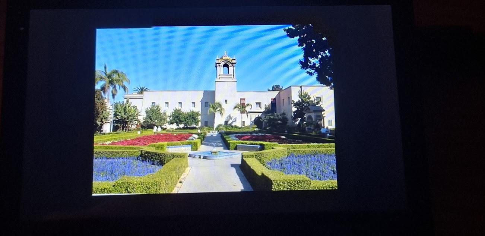

# ESP32-S3 SD Gallery 🖼️

A high-performance digital photo frame and file browser for the **Waveshare ESP32-S3-Touch-LCD-4.3**.

This project features a custom-built rendering engine that uses **LVGL** for the user interface and **Direct Hardware Rendering** for displaying images. It is designed to handle high-resolution **JPEG** files (up to 13MP+) by intelligently downscaling them to fit the screen without crashing.




## 🚀 Key Features

* **Smart Scaling:** Automatically detects large images (e.g., 4000x3000) and downscales them using hardware-accelerated integer math (1/2, 1/4, 1/8) to fit the 800x480 screen.
* **Direct Hardware Rendering:** Bypasses the UI layer to write pixels directly to the LCD driver's framebuffer, utilizing manual Cache Flushing for maximum speed.
* **Crash Prevention:** Includes memory safety checks to reject files larger than available PSRAM (~6MB limit) before attempting to load them.
* **File Browser:** A clean LVGL-based interface to navigate folders and select images from the SD card.
* **Center Cropping:** Automatically centers images that don't match the screen aspect ratio.

## 🛠️ Hardware Requirements

* **Board:** [Waveshare ESP32-S3-Touch-LCD-4.3](https://www.waveshare.com/esp32-s3-touch-lcd-4.3.htm)
* **Storage:** Micro SD Card (Formatted FAT32)
* **Connection:** USB-C cable for programming

## 📦 Software Dependencies

Install the following libraries via the **Arduino Library Manager**:

| Library  	|   Version	| 
|---	|---	|
|   [ESP3](https://github.com/espressif/arduino-esp32)	|  3.3.4 	|  
| [LVGL](https://github.com/lvgl/lvgl) 	|  8.4.0 	| 
|   [ESP32_Display_Panel](https://github.com/esp-arduino-libs/ESP32_Display_Panel)	|  1.0.0 	|  
|   [ESP32_IO_Expander](https://github.com/esp-arduino-libs/ESP32_IO_Expander/)	|  1.0.1 	|  
|  [JPEGDEC](https://github.com/bitbank2/JPEGDEC) |  1.8.4 	|  


## ⚙️ Installation & Setup

1.  **Clone the Repository:**
    ```bash
    git clone [https://github.com/your-username/esp32-sd-gallery.git](https://github.com/your-username/esp32-sd-gallery.git)
    ```
2.  **Prepare the SD Card:**
    * Format your Micro SD card to **FAT32**.
    * Place your `.jpg` or `.jpeg` images into folders on the card.
3.  **Arduino IDE Settings:**
    * **Board:** `ESP32S3 Dev Module`
    * **Flash Size:** `16MB` (or as per your board variant)
    * **Partition Scheme:** `Huge APP (3MB No OTA/1MB SPIFFS)` or any scheme providing ample app space.
    * **PSRAM:** `OPI PSRAM` **(Crucial: Must be Enabled)**
4.  **Upload:**
    * Connect the board while holding the `BOOT` button (if required) and upload the sketch.

## 🧠 How It Works

### The Rendering Pipeline
The ESP32-S3 has limited internal RAM but abundant PSRAM. This project uses a specific pipeline to ensure stability with large files:

1.  **Load to PSRAM:** The JPEG file is read from the SD card into a raw memory buffer in PSRAM.
2.  **Header Analysis:** The code reads the JPEG header to determine dimensions.
3.  **Smart Scale Calculation:**
    * If width > 3000px → Decode at **1/8** scale.
    * If width > 1500px → Decode at **1/4** scale.
    * If width > 800px → Decode at **1/2** scale.
    * Otherwise → Decode at **1:1**.
4.  **Cache Coherency:** Before drawing to the screen, `Cache_WriteBack_Addr()` is called to force the CPU cache to flush data to the physical RAM, ensuring the DMA controller sees the pixel data immediately.

## 🐛 Troubleshooting

| Issue | Cause | Solution |
| :--- | :--- | :--- |
| **Blue Screen / "Decode Failed"** | The JPEG is likely "Progressive" format. | The ESP32 hardware decoder only supports **Baseline** JPEGs. Re-save the image as "Baseline" or "Standard" using Paint or Photoshop. |
| **Red Screen / Error** | The file is larger than available RAM. | The project caps file size at ~6MB to reserve space for the framebuffer. Resize the image on a PC. |
| **Slow Rendering** | PSRAM not enabled. | Ensure `OPI PSRAM` is selected in the Arduino Tools menu. |

## 📜 License

This project is open-source. Feel free to modify and adapt it for your own digital frame projects.
